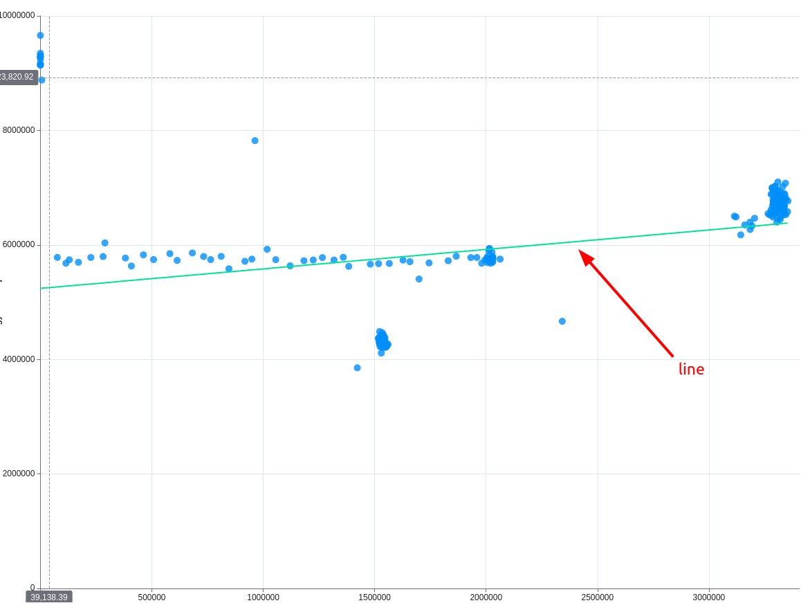

# echarts-stat-regression

This repository provides files that enable you to apply the "regression" method to ECharts' registerTransform.

The [echarts-stat](https://github.com/ecomfe/echarts-stat) library is outdated and may encounter TypeScript compatibility issues when imported into Angular projects, especially when building a library using [ng-packagr](https://www.npmjs.com/package/ng-packagr).

This script focuses solely on regression and does not include any other methods.

## How to Use?

1. Place all files from the src folder in some folder.
2. Import modules in your code:

```javascript
import * as echarts from 'echarts/dist/echarts.esm.js';
import ecStatRegression from '../utils/regression-line/regression';


// ...

constructor() {
  echarts.registerTransform(ecStatRegression);
}
```


